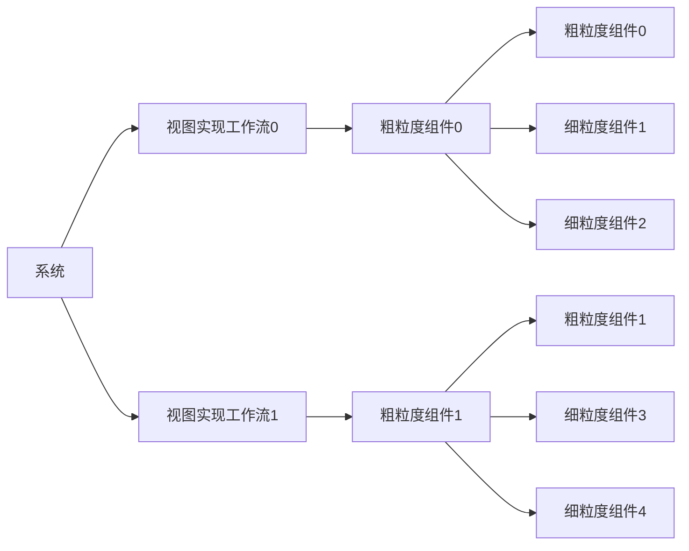

#  Intelligent Attractions Platform (IAP) 前端项目
> 参考资料
> - Three.js 地形图参考代码: https://github.com/orabazu/threejs-dem-visualizer/tree/master
> - Three.js 教程: https://threejs.org/manual/#zh/materials
> - 百度地图api Vue 封装组件: https://yue1123.github.io/vue3-baidu-map-gl/

## 前端详细设计文档（用户界面搭建）
前端设计思路。前端采用组件化的编写方式，我们将具体的小的功能内聚在某一个或某几个组件里，然后将这些组件组合在一个视图里以实现不同的工作流。例如，由于二维地图数据与三维 DEM 数据具有不同的特点，编辑分析也需要不同的方式。所以，我们将这对两种数据的操作分别抽象成不同的数据流，然后将这些数据流组合在一个视图里，以实现不同的功能。这样的设计思路可以使得我们的代码更加清晰，便于后期的维护与扩展。尤其是系统的拓展性方面，我们可以根据需要添加新的功能，而不需要对原有的代码进行修改。

### 1. 地图 map
> - https://yue1123.github.io/vue3-baidu-map-gl/
地图类的主要功能包括两个方面，一方面展示基础地理信息数据（作为底图），另一方面提供一些地理分析数据可视化函数（在底图的基础上结合地理信息的特点将数据可视化表达，如热力图等）。
#### 百度地图 （basemap）
- 基于百度地图 api 实现地图底图的展示，这一块作为二维底图。
- 一些基于地理的信息渲染（热力图、棱柱等）

#### 基于 DEM 的三维地图 （map3d）
- 使用 Three.js 实现 DEM 的三维展示，并将该地区的遥感影像作为 DEM 的纹理，实现 DEM 的三维展示。这一块作为三维底图。
- 显示效果优化建议：
  - 根据遥感影像的不同，将 DEM 的纹理进行分类，如：森林、草地、沙漠、水域等，然后根据不同的分类设置不同的纹理，以达到更好的显示效果。
  - 全局光照设置，使得 DEM 的纹理更加真实。
- 手动编写一些三维数据可视化功能，如三维棱柱、三维热力图、三维淹没模拟等。

### 2. 表格table
- 主要用于展示结构化、重复信息，如景点列表、景点信息、景点评论等。
### 3. 图表chart
- 主要用于显示一些统计数据，如景区人流量、景区游客年龄分布、景区游客性别分布等。
> - reference : https://vue-chartjs.org/guide/#creating-your-first-chart
- 逐小时游客人流量
  - 实际数据：截止到当前时间点客流量曲线
  - 预测数据：根据实际数据预测后几个小时内曲线变化（采用）
  - 景区人流量相关矩阵
### 4. 信息/数据data
- 主要用于信息录入，图片上传等功能
### 5. 算法helpers
- 用于整理一些空间分析算法，便于项目的组织管理

### 百度地图 VUE 封装组件
> - 链接 : https://yue1123.github.io/vue3-baidu-map-gl/zh-CN/guide/installation

#### 登陆注册组件
- 将用户登陆与注册功能集成在一个组件中，通过切换不同的 tab 来实现登陆与注册的切换
- 用户登陆后获取用户的 token，将 token 保存在本地，之后的所有请求都需要携带 token。token 的有效期为 1 天，过期后需要重新登陆获取新的 token

#### 景区介绍小卡片（带有图片）
> 参考： https://element-plus.org/zh-CN/component/card.html#有图片内容的卡片
- 卡片文字内容：
  - XX山是一座位于XX省XX市XX县的XX级AAAAA景区，景区面积XX平方公里，海拔XX米，主峰XX米，是XX省最高的山峰。年人流量XX万人次，是XX省最受欢迎的景区之一。本系统将为您提供XX山的天气预报、景区介绍、景区地图、景区相册等服务。欢迎您的到来！
- 卡片图片内容：
  - 一张XX山的图片，直接使用图片链接就可以，不需要下载图片到本地
  - 

#### 动态天气小组件
- 使用天气接口动态获取天气信息
- 动态渲染天气情况，也可以将天气信息与地图事件绑定，当用户点击地图上的某个景点时，天气组件会自动更新天气信息
