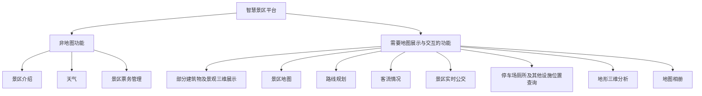

# 智慧景区平台 (Intelligent Attraction Platform)

## 计划
### 7.4 日需要完成的任务
- [ ] 后端任务见[Backend/README.md](Backend/README.md)
- [ ] 前端任务见[IAP/README.md](IAP/README.md)
- [ ] 文档任务见[Docs/project.md](Docs/project.md)
### 6.29 日下午需要完成的任务
- [x] 完成前后端开发框架的搭建
- [x] 配置并运行后端基础框架
- [x] 利用 E-R 图梳理项目实体关系
- [x] 详细讨论项目功能点（结合实体及关系），若有不合理或难实现的功能，需要及时调整
- [x] 编写前后端示例代码
## 选题背景
智慧景区是智慧旅游的分支，是随着信息技术发展而衍生出来的全新理念。2014年为“智慧旅游”元年，同时也开启了景区的智慧化建设。在竞争如此激烈的环境下，景区必须顺应时代发展，与新技术接轨，打造智慧景区，才能更好的满足游客的需求。目前景区平台功能分散，不便于游客查询信息，因此我们制作智慧景区平台，以求在同一平台上满足游客的绝大部分需求。

## 功能点

### 1. 非地图功能

#### 1.1 景区介绍：
- 包括提供景区的相关信息、景区周边的食宿推荐以及游客对景区的评价。
- 前端以图文并茂的信息卡片的形式展示
- 后端提供数据接口，视后端项目进度而定，若后端项目进度不够，前端使用静态 JSON 数据。
#### 1.2 天气（以小组件形式展示）：
可查询近期天气，便于游客更好的安排出行计划。使用公开的天气 API，动态获取天气信息。
#### 1.3 景区票务管理：
实现在线预定景区门票、查询预定订单、退票等操作。（待定，该功能与地理信息系统关系较弱。）
### 2. 需要地图展示与交互的功能

#### 2.1 部分建筑物及景观三维展示

借助于 Three.js 前端三维库，对景区进行实景三维展示，真实的展示出部分景区环境、房屋、道路。还可以插入对某个具体建筑的文字和语音介绍，提升体验效果，方便用户进一步了解。

- 数据源：当地 DEM 地形图及卫星图像（纹理贴图）
- 主要功能：基于 DEM 实现一些经典的地形分析，如坡度、坡向、等高线、剖面图等。借助于 Three.js 实现陆地、水体、森林等不同材质的渲染，实现真实美观的景区三维展示。
#### 2.2 景区地图
借助于百度地图 API，实现景区平面地图展示，地图的放大、缩小、显示全图、移图、鹰眼，展示游客当前位置和景点的具体位置，可实现多种风格的地图显示。
#### 2.3 路线规划（最短路径查询）
根据用户选取想要浏览的景点进行游览景点路线的规划。既可以借助于百度地图 API 实现，也可以自己实现最短路径算法。（根据项目进度酌情实现）

#### 2.4 客流情况（热力图、图表）
实时显示道路客流情况，便于用户判断交通情况，减缓道路拥堵问题。
- 人数逐地点逐小时统计（预测）：统计某一地点游客逐小时的人数统计（使用折线图展示）。根据最小二乘法拟合出游客人数的变化趋势，预测未来（两到三小时的）游客人数。
- 热力图渲染：地图上采用热力图渲染游客密集程度（使用热力图展示）
- 智能路线推荐：根据人流情况，及游客浏览景点的时间，推荐游览路线。
#### 2.5 景区实时公交（模拟公交）
实现景区公交站点，班次，车辆位置等信息的可视化。（这一块由于没有真实世界数据，所以实现起来较为困难）
#### 2.6 停车场、厕所及其他设施位置查询（缓冲区查询）
用户可以根据当前位置寻找距离最近的设施，也可以按照属性（名称、类别）查找。这一部分我们充分利用动态地图及信息列表，实现列表展示详细信息、细致过滤，地图动态展示位置、缩放、定位等功能。
#### 2.7 地形三维分析
基于DEM进行坡度和坡向的分析和展示，可以在二维地图中选取区域并展示其剖面图和三维，可模拟暴雨时的最佳逃生路线。
#### 2.8 地图相册
游客上传图片，系统同时记录图片的上传时间和地理坐标。系统可以根据地理坐标将图片以缩略图的形式显示在地图上，点击可查看详情。用户还可以选择一个时间段，系统将该时间段内的图片显示在地图上。用户可以生成游览轨迹，系统将该轨迹上的图片显示在地图上，并生成轨迹距离。

## 项目架构
- 前端：
  - 前端框架：Vue.js
  - 前端UI框架：Element Plus
  - 地图：百度地图API
  - 三维展示：three.js
  - 数据可视化：Echarts、Chart.js
  - 表格渲染：Ag-Grid
- 后端：
  - 后端框架：Fastapi + SQLAlchemy
  - 数据库：SQLite

