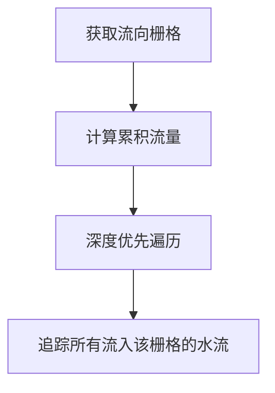

# 个人文档示例
## 基于流水物理模拟提取山谷线
上图中，我们根据 DEM 详细计算了该地区的山谷线，并以一定的规则渲染出来，为了更加清晰的呈现出我们想要的效果，我们也可以对结果进行二值化重分类。（可以调节阈值达到去除破碎线的效果，但是想要的到完美的地形栅格还需要再做后处理）

### 实现思路及代码
首先获取流向栅格，然后开始计算累积流量。累积流量采用深度优先遍历来追踪所有流入该栅格的水流。


```js
/**
 * 计算当前地形的模拟水流累积量栅格
 * @param {number} RealDistance - 当前栅格代表的真实距离（默认为1）
 * - 该方法不需要 padding 操作，返回值与原始栅格大小相同
 * @returns {Array} 返回一个二维数组，代表每一个栅格的累积量
 */
getAccumulationFlow(RealDistance){
    // let directionCode = [1,2,4,8,16,32,64,128]; // 0 带表无流向 1-128 代表8个方向
    // let direction = [[1,0],[1,-1],[0,-1],[-1,-1],[-1,0],[-1,1],[0,1],[1,1]];// 8个方向
    // let directuionCodeReverse = [128,64,32,16,8,4,2,1]; // 周围栅格的流向（按照direction找到周围，若周围栅格满足该流向，则目标栅格的累积量+1）
    // 1. 计算流向栅格
    let flowDirection = this.getFlowDirection(RealDistance);
    // 2. 计算累积流量栅格，深度优先搜索
    let res = this.#creataGridSet(this.row,this.column,0);
    for(let i = 0 ; i < this.row ; i++){
        for(let j = 0 ; j < this.column ; j++){
            let memo = {};
            let rest = AccumateFlow(i,j,flowDirection,this.row,this.column,memo);
            res[i][j] = rest;
        }
    }
    return res;
    /**
     * 深度优先搜索,计算当前栅格的累积量
     * @param {*} i - 当前栅格的行号
     * @param {*} j - 当前栅格的列号
     * @param {*} flowDirection - 当前栅格的流向
     * @param {*} memo 
     * @returns 
     */
    function AccumateFlow(i,j,flowDirection,row,col,memo={}){
        let direction = [[1,0],[1,-1],[0,-1],[-1,-1],[-1,0],[-1,1],[0,1],[1,1]];// 8个方向
        let directuionCodeReverse = [128,64,32,16,8,4,2,1]; // 周围栅格的流向（按照direction找到周围，若周围栅格满足该流向，则目标栅格的累积量+1）

        // 首先统计当前栅格的累积量
        let res = 0;
        for(let k = 0 ; k < 8 ; k++){
            let nr = i + direction[k][0];
            let nc = j + direction[k][1];
            if(nr >= 0 && nr < row && nc >= 0 && nc < col){
                if(flowDirection[nr][nc] == directuionCodeReverse[k]){
                    res += 1;
                }
            }
        }

        // 然后递归计算周围栅格的累积量
        for(let k = 0 ; k < 8 ; k++){
            let nr = i + direction[k][0];
            let nc = j + direction[k][1];
            if(nr >= 0 && nr < row && nc >= 0 && nc < col){
                if(flowDirection[nr][nc] == directuionCodeReverse[k]){
                    if(memo[nr+"-"+nc] == undefined){
                        memo[nr+"-"+nc] = true;
                        res += AccumateFlow(nr,nc,flowDirection,row,col,memo);
                    }
                }
            }
        }

        return res;   
    }
}
```

计算出累积栅格流量后，我们可以采用重分类函数将获取的栅格进行二值化以修饰分类结果。

```js
   // 根据阈值进行二值化（也叫重分类）
    // 二值化后的栅格值只有0和1
    // 0表示不属于该类 1表示属于该类
    // 该方法会改变原栅格
    /**
     * 根据阈值进行二值化（也叫重分类）
     * - **该方法不反回新的栅格，而是直接在原栅格上进行修改**
     * @param {number} threshold 阈值
     * @returns - 无返回值(直接在原栅格上进行修改)
     * - 重分类后的栅格值只有0和1，而不是返回一个新的栅格
     */
    reClassify_Binary_(threshold){
        // alert("该方法会改变原栅格");
        for(let i = 0; i < this.row ;i++){
            for(let j = 0; j < this.column;j++){
                if(this.gridset[i][j] >= threshold){
                    this.gridset[i][j] = 1;
                }else{
                    this.gridset[i][j] = 0;
                }
            }
        }
        console.log(this.gridset);
    }
```

## 系统设计思路（组件化管理）
考虑到 Vue 需要一些学习成本，小组内成员对于 Vue 的使用并不熟练，因此我们采用了一种简单的组件化管理方式，将整个系统分为了三个部分：**地图展示组件**、**工具栏组件**、**工具组件**。其中地图展示组件负责展示地图，工具栏组件负责展示工具栏，工具组件负责展示工具栏中的工具。这样的设计思路使得我们可以更加方便的对系统进行维护和扩展。
页面的组件化管理主要基于 Web Component 实现，我们将每一个组件封装成一个 Web Component，然后在页面动态的添加和删除这些组件，从而实现页面的组件化管理。

### 地图展示组件
我们在该组件内封装了百度地图底图，并将其以 map 对象暴露出操作接口，同一页面的所有工具都可以通过该 map 对象来进行地图操作。同时，我们也将地图的一些基本操作封装成了方法，方便其他组件调用。