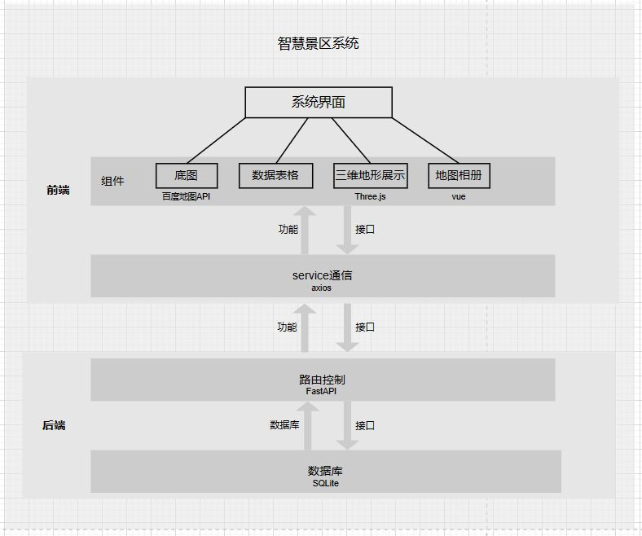

# 实习报告
> - 该文档的内容用于支撑实习报告的编写，使用 Markdown 格式利于团队协作。
> - 任务书框架如下，前有 # 号的为一级标题，前有 ## 号的为二级标题，以此类推。表格样式见下方。
> - 该模板与实习报告的 Word 模板一一对应，除了最后的实习总结部分，其余部分均可直接复制粘贴。
> - 图片引用格式为：``，图片路径为相对路径，相对于 docs 目录。所有图片均放置在 docs 目录下的 imgs 目录中。统一采用英文命名。

## 实习任务书
1. 实习名称：GIS软件工程生产实习    
2. 实习时间：2023.6.26-2023.7.9      
3. 实习地点：山东科技大学青岛校区               
4. 实习主要内容与进度安排
   - 第一周：确定选题、讨论项目设计、编写前后端代码；
   - 第二周：编写前后端代码、撰写实习报告书。               
5. 具体要求（技术要求等）：根据实习要求，确定项目选题与项目功能设计，根据选题要求，设计数据库，编写前后端代码，实现相关功能。

## 第 1 章 实习概况

### 1.1 实习目的

GIS软件工程生产实习是运用地理信息系统工程设计与开发全过程中的多个关键技术进行实践的课程实习，在实践中熟悉和掌握GIS软件工程研发的方法和具体步骤，并能独立完成一个GIS原型设计开发实践。

此实习的主要目的是培养学生综合应用计算机编程技术、数据结构、数据库技术、GIS软件开发技术、Web及移动编程技术、软件工程等相关知识，学习和使用当前最新的GIS软件工程设计开发工具，深入掌握GIS工程的软件平台和工具并结合实际应用需求，进行GIS应用软件设计和研发的能力。该实习课程的重点内容包括关键技术研究、开发框架选择、系统功能设计、系统功能实现、系统测试、程序部署与发布等内容。

GIS软件工程生产实习以小组的形式，依据GIS软件建设需求及设计要求，应用成熟的平台工具实现具体的GIS软件研发，要求小组成员分工、协作解决，发挥每个人的能动性，并合众人之力最大限度的完成课程设计要求。

通过GIS软件工程生产实习，使学生加深理解并掌握相关课程中所学的GIS软件开发方法，熟悉并实践从GIS开发项目选题到撰写报告及整个GIS软件生产的过程，对GIS软件生产技术进行总结和提炼。培养学生应用GIS软件开发技术解决本专业中实际问题的能力，提升学生创新创业的能力。

### 1.2 实习任务

近年来，我国旅游市场保持较快增长。2020年，尽管受到新冠肺炎疫情冲击，但行业恢复发展呈现积极向好态势。后疫情时代，旅游业“重振旗鼓”，重新爆发出新的活力。

以“互联网+旅游”为代表的旅游新业态快速发展，进一步推动了生产方式、服务方式、管理模式的创新，也丰富了产品业态，进一步拓展了旅游消费空间。从早期线上找旅行社，到线上查出游攻略，再到如今线上预约景区门票，中国旅游研究院院长戴斌认为，以互联网为代表的现代信息技术带动了一轮又一轮的旅行服务创新。而大数据、云计算、移动通信和智能终端在旅游业的加速应用，既带来消费方式的变化，也改变了旅游服务的供给方式。

智慧景区是指通过智能网络，对景区地理事物、自然资源、旅游者行为、景区工作人员行迹、景区基础设施和服务设施进行全面、透彻、及时的感知；对游客、景区工作人员实现可视化管理；同旅游产业上下游企业形成战略联盟；实现景区环境、社会和经济的全面、协调和可持续发展。

在国家加快智慧旅游的政策引导下，越来越多的景区开始触网，寻求新的发展路径，开辟APP、网上预订及微信营销等渠道，并主动寻求与OTA（在线旅游服务商）的开放合作。

本次实习任务针对智慧景区问题，设计并开发智慧景区服务系统，将本地的旅游景区、周边餐饮、推荐游览路线等服务进行互联网化整合，进行三维展示，以平台化的方式提供给有需求的游客，研究使用vue框架、Three.js、SOLlite等，建立面向大众游客的智慧景区服务系统，以减少游客搜集信息的时间，提高效率，提升游客旅游体验感，促进我国旅游业的发展。
### 1.3 实习安排
#### 1.3.1 实习时间
2023年6月26日-2023年7月9日
#### 1.3.2 实习地点
山东科技大学青岛校区
#### 1.3.3 小组成员
   - 组长：张清韵
   - 组员：李嘉怡、刘敏、潘志清、覃仕锋
#### 1.3.4 实习任务
  1. 选题讨论
  2. 需求分析
  3. 资料收集和分析
  4. 数据库设计
  5. 系统功能设计
  6. 系统开发
  7. 系统测试 
  8. 撰写实习报告 
#### 1.3.5 项目人员分工
|序号|成员|主要职责|
|:---:|:---:|:---:|
|1|张清韵|后端接口编写与测试|
|2|李嘉怡|前端一般组件实现|
|3|刘敏|后端数据库设计与实现|
|4|潘志清|前端架构设计、前端三维实现|
|5|覃仕锋|前端三维实现|

## 第 2 章 实习内容
### 2.1 项目背景
智慧旅游是旅游信息化建设更高层次和更全面的指导策略，也是旅游信息化建设价值更深程度的体现。国家旅游局明确指出各地要结合旅游业发展方向，以智慧旅游为主题，引导智慧旅游城市、景区等旅游目的地建设，特别要在智慧服务、智慧管理和智慧营销三方面加强旅游资源和产品的开发和整合，促进以信息化带动旅游业向现代服务业转变，努力提升旅行社、旅游景区、旅游酒店等旅游企业的现代科技管理水平和服务水平，创新发展模式，推动中国旅游业又好又快发展。

智慧景区是智慧旅游的分支，是随着信息技术发展而衍生出来的全新理念。2014年为“智慧旅游”元年，同时也开启了景区的智慧化建设。在竞争如此激烈的环境下，景区必须顺应时代发展，与新技术接轨，打造智慧景区，才能更好的满足游客的需求。目前景区平台功能分散，不便于游客查询信息，因此我们制作智慧景区平台，以求在同一平台上满足游客的绝大部分需求。

### 2.2 关键技术
- 前端：
  - 前端框架：Vue.js
  - 前端UI框架：Element Plus
  - 地图：百度地图API
  - 三维展示：three.js
  - 数据可视化：Echarts、Chart.js
  - 表格渲染：Ag-Grid
- 后端：
  - 后端框架：Fastapi + SQLAlchemy
  - 数据库：SQLite
  
### 2.3 需求分析
#### 2.3.1 用户需求
#### 2.3.2 数据需求
#### 2.3.3 业务需求
#### 2.3.4 功能需求

### 2.4 数据库设计
#### 2.4.1 概念结构设计
对需求而进行综合、归纳与抽象、对信息世界进行建模，常用的模型概念是E-R图。

#### 2.4.1 逻辑结构设计
逻辑结构设计——将概念结构设计阶段完成的概念模型，转换成能被选定的数据库管理系统(DBMS)支持的数据模型。这里主要将E-R模型转换为关系模型。需要具体说明把原始数据进行分解、合并后重新组织起来的数据库全局逻辑结构，包括所确定的关键字和属性、重新确定的记录结构和文件结构、所建立的各个文件之间的相互关系，形成本数据库的数据库管理员视图。
逻辑结构设计一般分为三步进行：
1. 从E-R图向关系模式转化 数据库的逻辑设计主要是将概念模型转换成一般的关系模式，也就是将E-R图中的实体、实体的属性和实体之间的联系转化为关系模式。
2. 数据模型的优化 数据库逻辑设计的结果不是唯一的。为了进一步提高数据库应用系统的性能，还应该适当修改数据模型的结构，提高查询的速度。
3. 关系视图设计 关系视图的设计又称为外模式的设计，也叫用户模式设计，是用户可直接访问的数据模式。同一系统中，不同用户可有不同的关系视图。关系视图来自逻辑模式，但在结构和形式上可能不同于逻辑模式，所以它不是逻辑模式的简单子集。

#### 2.4.2 物理结构设计
物理结构设计——为逻辑数据模型选取一个适合应用环境的物理结构（存储结构和存取方法）。数据库在物理设备上的存储结构和存取方法的设计。包括为关系模式选择存取方法，设计表、索引等数据库文件的物理存储结构。
将多种信息分别存储在不同表中，即将大表分表；数据库所有数据均存储在同一硬盘当中。

### 2.5 系统功能设计
#### 2.5.1 系统总体架构设计

功能实现
#### 2.5.2 非地图功能
##### 2.5.2.1 景区介绍：
包括提供景区的相关信息、景区周边的食宿推荐以及游客对景区的评价。

##### 2.5.2.2 天气（以小组件形式展示）：
可查询近期天气，便于游客更好的安排出行计划。

##### 2.5.2.3 景区票务管理：
实现在线预定和支付景区门票、查询预定订单、退票等操作，游客从平台购买景区门票，通过身份证、二维码认证快速入园，提升游客体验，使旅游服务质量得到保障。

#### 2.5.3 需要地图展示与交互的功能
##### 2.5.3.1 部分建筑物及景观三维展示
借助于 Three.js 前端三维库，对景区进行实景三维展示，真实的展示出部分景区环境、房屋、道路。还可以插入对某个具体建筑的文字和语音介绍，提升体验效果，方便用户进一步了解。游客进入景区可自助听导览，查看景区地图、景点介绍等，能够深度了解各个景点背后的故事，增强旅游的趣味性。

##### 2.5.3.2 景区地图
 景区平面地图展示，地图的放大、缩小、显示全图、移图、鹰眼，展示游客当前位置和景点的具体位置，可实现多种风格的地图显示。

##### 2.5.3.3 路线规划（最短路径查询）
根据用户选取想要浏览的景点进行游览景点路线的规划。

##### 2.5.3.4 客流情况（热力图、图表）
 实时显示道路客流情况，便于用户判断交通情况，减缓道路拥堵问题。

##### 2.5.3.5 景区实时公交
实现景区公交站点，班次，车辆位置等信息的可视化。

##### 2.5.3.6 停车场、厕所及其他设施位置查询（缓冲区查询）
用户可以根据当前位置寻找距离最近的设施，也可以按照属性（名称、类别）查找。

##### 2.5.3.7 地形三维分析
基于DEM进行坡度和坡向的分析和展示，可以在二维地图中选取区域并展示其剖面图和三维，可模拟暴雨时的最佳逃生路线。

##### 2.5.3.8 地图相册
游客上传图片，系统同时记录图片的上传时间和地理坐标。系统可以根据地理坐标将图片以缩略图的形式显示在地图上，点击可查看详情。用户还可以选择一个时间段，系统将该时间段内的图片显示在地图上。

### 2.6 开发环境

### 2.7系统功能实现
#### 2.7.1 系统架构

#### 2.5.2 功能实现

## 第 3 章 实习总结 
### 3.1 实习总结
### 3.2 实习收获
