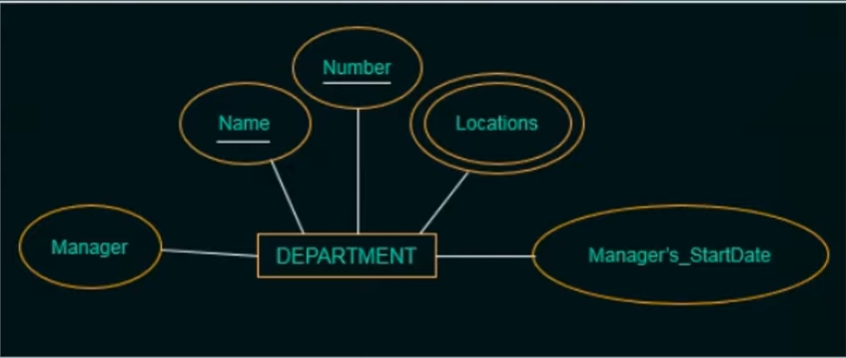
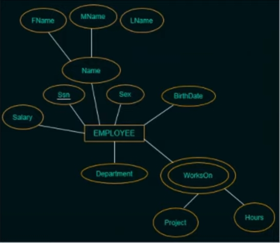

# 数据库设计流程样例
  > - weak entity types:
  >   -  Entity types that do not have key of their own. 没有自己的键的实体类型。
  >   -  Idetitifying by relating to another entity type called the indentiufying or the owner entity type. 通过与另一个实体类型相关联来识别，称为识别或所有者实体类型。
  >   -  Relationship between weak entity type to its owner entity type is called the identifying relationship.  弱实体类型与其所有者实体类型之间的关系称为识别关系。

### 数据库设计的简单例子 COMPANY

#### 需求收集
- **公司**由**部门**组成。每一个部门都有唯一的名字、唯一编号以及唯一的部门经理。系统需要记录该经理的上任时间。每一个部门都有多个地理位置。
- 一个部门掌管许多**项目**，每一个项目都有唯一的名字、唯一的编号以及唯一的地理位置。
- **员工**信息包括：姓名、SSN（社会安全号）、性别、出生日期、地址、工资。系统需要追踪该员工每周在每个项目中的工作时间。
- 系统还需要维护员工依赖关系（名、性别、与该员工的关系）
#### 初步数据库概念结构设计
- 从上述描述中，我们可以找到四个实体
  - 部门（Department）：部门名称（Name）、部门编号（Number）、部门位置({Locations}由于一个部门有多个位置，所以这是一个多值属性，需要用双椭圆画出)、部门经理（Manager）、上任时间（ManagerStartDate）
  
  - 项目（Project）：项目名称（Name）、项目编号（Number）、项目位置（Location）、所属部门编号（ControllingDepartment）
  
  - 员工（Employee）：姓名（Name）、SSN（SSN）、性别（Sex）、出生日期（BirthDate）、所属部门（Department）、工作时间 ( {WorksON (Project,Hours) } )
  
  - （弱实体）依赖关系（Dependent）：员工（Employee）、依赖名称（DependentName）、性别（Sex）、出生日期（BirthDate）、与该员工的关系（Relationship）
  
