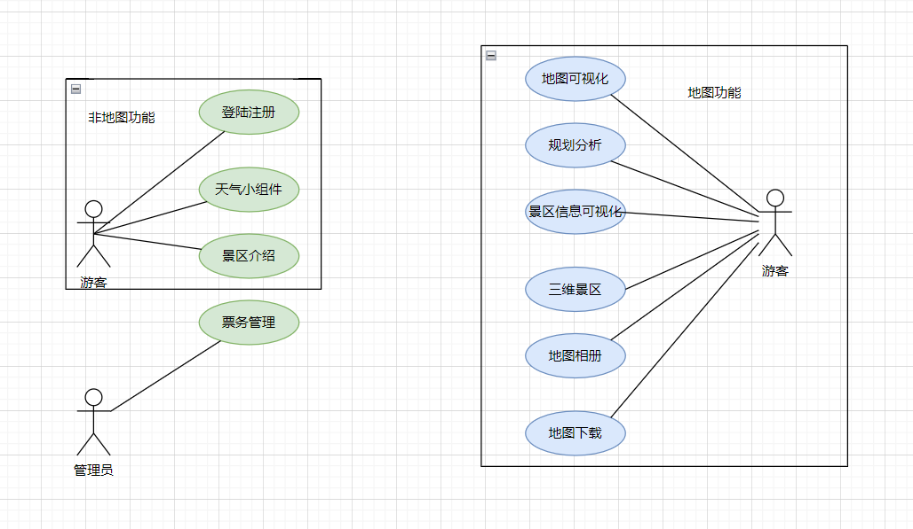

# 实习报告
> - 该文档的内容用于支撑实习报告的编写，使用 Markdown 格式利于团队协作。
> - 任务书框架如下，前有 # 号的为一级标题，前有 ## 号的为二级标题，以此类推。表格样式见下方。
> - 该模板与实习报告的 Word 模板一一对应，除了最后的实习总结部分，其余部分均可直接复制粘贴。
> - 图片引用格式为：``，图片路径为相对路径，相对于 docs 目录。所有图片均放置在 docs 目录下的 imgs 目录中。统一采用英文命名。
## 第1章 选题背景

智慧景区是指通过智能网络，对景区地理事物、自然资源、旅游者行为、景区工作人员行迹、景区基础设施和服务设施进行全面、透彻、及时的感知；对游客、景区工作人员实现可视化管理；同旅游产业上下游企业形成战略联盟；实现景区环境、社会和经济的全面、协调和可持续发展。

### 1.1  自然背景
我国960余万平方公里的国土、占世界陆地总面积的十五分之一，自北而南跨越6个不同的气候带。这样的地理条件使得我国拥有众多特色地理景观、自然资源和生态资源，旅游资源十分丰富。要利用好众多地理资源，完善综合服务功能，建设一批山岳、海岛、湿地、冰雪、草原、沙漠、湖泊、温泉、康养等旅游目的地，并在此基础上，建立智慧景区平台，提升游客旅行体验。

### 1.2  人文背景
#### 1.2.1  政治方面

智慧旅游是旅游信息化建设更高层次和更全面的指导策略，也是旅游信息化建设价值更深程度的体现。国家旅游局明确指出各地要结合旅游业发展方向，以智慧旅游为主题，引导智慧旅游城市、景区等旅游目的地建设，特别要在智慧服务、智慧管理和智慧营销三方面加强旅游资源和产品的开发和整合，促进以信息化带动旅游业向现代服务业转变，努力提升旅行社、旅游景区、旅游酒店等旅游企业的现代科技管理水平和服务水平，创新发展模式，推动中国旅游业又好又快发展。
在国家加快智慧旅游的政策引导下，越来越多的景区开始建设依托大数据、云计算的智慧景区平台。

#### 1.1.2  经济方面
近年来，我国旅游市场保持较快增长。2020年，尽管受到新冠肺炎疫情冲击，但行业恢复发展呈现积极向好态势。后疫情时代，旅游业“重振旗鼓”，重新爆发出新的活力。

以“互联网+旅游”为代表的旅游新业态快速发展，进一步推动了生产方式、服务方式、管理模式的创新，也丰富了产品业态，进一步拓展了旅游消费空间。从早期线上找旅行社，到线上查出游攻略，再到如今线上预约景区门票，中国旅游研究院院长戴斌认为，以互联网为代表的现代信息技术带动了一轮又一轮的旅行服务创新。而大数据、云计算、移动通信和智能终端在旅游业的加速应用，既带来消费方式的变化，也改变了旅游服务的供给方式。

2014年为“智慧旅游”元年，同时也开启了景区的智慧化建设。在竞争如此激烈的环境下，景区必须顺应时代发展，与新技术接轨，打造智慧景区，才能更好的满足游客的需求。目前景区平台功能分散，不便于游客查询信息，因此我们制作智慧景区平台，以求在同一平台上满足游客的绝大部分需求。

## 第2章 选题目的

GIS软件工程生产实习是运用地理信息系统工程设计与开发全过程中的多个关键技术进行实践的课程实习，在实践中熟悉和掌握GIS软件工程研发的方法和具体步骤，并能独立完成一个GIS原型设计开发实践。

此实习的主要目的是培养学生综合应用计算机编程技术、数据结构、数据库技术、GIS软件开发技术、Web及移动编程技术、软件工程等相关知识，学习和使用当前最新的GIS软件工程设计开发工具，深入掌握GIS工程的软件平台和工具并结合实际应用需求，进行GIS应用软件设计和研发的能力。该实习课程的重点内容包括关键技术研究、开发框架选择、系统功能设计、系统功能实现、系统测试、程序部署与发布等内容。

GIS软件工程生产实习以小组的形式，依据GIS软件建设需求及设计要求，应用成熟的平台工具实现具体的GIS软件研发，要求小组成员分工、协作解决，发挥每个人的能动性，并合众人之力最大限度的完成课程设计要求。

通过GIS软件工程生产实习，使学生加深理解并掌握相关课程中所学的GIS软件开发方法，熟悉并实践从GIS开发项目选题到撰写报告及整个GIS软件生产的过程，对GIS软件生产技术进行总结和提炼。培养学生应用GIS软件开发技术解决本专业中实际问题的能力，提升学生创新创业的能力。

本次实习任务针对智慧景区问题，设计并开发智慧景区服务系统，将本地的旅游景区、周边餐饮、推荐游览路线等服务进行互联网化整合，进行三维展示，以平台化的方式提供给有需求的游客，研究使用vue框架、Three.js、SOLlite等，建立面向大众游客的智慧景区服务系统，以减少游客搜集信息的时间，提高效率，提升游客旅游体验感，促进我国旅游业的发展。

## 第3章 实习安排

### 3.1  实习时间
- 2023年6月26日-2023年7月9日
### 3.2  实习地点
- 山东科技大学青岛校区
### 3.3  小组成员
- 组长：张清韵
- 组员：李嘉怡、刘敏、潘志清、覃仕锋
### 3.4  实习内容
1. 选题讨论
2. 需求分析
3. 资料收集和分析
4. 数据库设计
5. 系统功能设计
6. 系统开发
7. 系统测试 
8. 撰写实习报告 
### 3.5  人员分工

|序号|成员|主要职责|
|:---:|:---:|:---:|
|1|张清韵|后端接口编写与测试|
|2|李嘉怡|前端一般组件实现|
|3|刘敏|后端数据库设计与实现|
|4|潘志清|前端架构设计、前端三维实现|
|5|覃仕锋|前端三维实现|

## 第4章 开发流程
- 确定项目主题与基本的框架功能，并进行小组分工;

### 4.1  项目启动
### 4.2  需求阶段
### 4.3  设计阶段

## 第5章 需求分析

### 5.1  用户需求
系统能够为不同用户的需求服务，管理员层面能够进行用户信息的录入，以及数据库维护工作，并进行数据的更新、录入与删除等，能够获取客流信息、游客游览路径等数据，并进行分析处理，得到具有统计意义的结果，录入信息库。游客层面能够实现注册与登录功能、获取景区地图并进行景区信息、路线规划、三维模型和相关设施等信息的查询等。
### 5.2  数据需求
### 5.3  业务需求
### 5.4  功能需求

## 第6章 数据库设计	
### 6.1 概念结构设计：
- 使用 post 作为图文信息的抽象最大限度地减少数据冗余，同时使用 image 作为图片的抽象，将图片的访问链接及系统路径存储在数据库中，同时将图片存储在本地，以实现简单的图床服务。
- 数据库
  - 图片(image): 本平台实现简单的图床服务，对所有上传平台的图片采用 UID 组织，存储在本地，同时将图片的访问链接及系统路径存储在数据库中。
  - 帖子(post): 帖子是图文信息的抽象，一个帖子可以包含一段简短的文字及多张图片。
    - 帖子也是导览路径的信息载体，通过创建带有坐标信息的帖子，可以实现导览路径的创建。
    - 帖子也可以聚合在地图上形成用户足迹，通过用户的足迹可以了解用户的游览情况。
  - 用户(User): 本平台实现简单的用户系统，用户可以注册、登录、修改个人信息、上传图片、查看图片、删除图片等操作。
  - 景点(Attraction): 景点是景区的基本组成单位，景点包含景点名称、景点介绍、景点图片、景点坐标等信息。同时，景点也可精选用户帖子作为景点的展示内容。
- 静态资源（assets）:
  - 栅格信息: DEM 作为三维地形图的底图，通过栅格信息可以实现三维地形图的展示。
  - 遥感影像: 遥感影像作为三维地形的贴图纹理。

### 6.2 逻辑结构设计
逻辑结构设计——将概念结构设计阶段完成的概念模型，转换成能被选定的数据库管理系统(DBMS)支持的数据模型。这里主要将E-R模型转换为关系模型。需要具体说明把原始数据进行分解、合并后重新组织起来的数据库全局逻辑结构，包括所确定的关键字和属性、重新确定的记录结构和文件结构、所建立的各个文件之间的相互关系，形成本数据库的数据库管理员视图。

- 逻辑结构设计一般分为三步进行：

  1. 从E-R图向关系模式转化 数据库的逻辑设计主要是将概念模型转换成一般的关系模式，也就是将E-R图中的实体、实体的属性和实体之间的联系转化为关系模式。
  2. 数据模型的优化 数据库逻辑设计的结果不是唯一的。为了进一步提高数据库应用系统的性能，还应该适当修改数据模型的结构，提高查询的速度。
  3. 关系视图设计 关系视图的设计又称为外模式的设计，也叫用户模式设计，是用户可直接访问的数据模式。同一系统中，不同用户可有不同的关系视图。关系视图来自逻辑模式，但在结构和形式上可能不同于逻辑模式，所以它不是逻辑模式的简单子集。

### 6.3 物理结构设计

## 第7章 功能设计

### 7.1  系统总体架构设计

1. 本系统采用前后端分离设计，后端负责提供数据管理接口，前端主要负责数据渲染、地形渲染等功能。以下是具体介绍:
   - 后端：
     - 数据库管理：负责数据库的管理，包括数据库的创建、数据表的创建、数据表的增删改查等操作。
     - 路由管理：负责接口的管理，包括接口的创建、接口的调用等操作。
     - 访问控制：负责对接口的访问进行控制，包括对接口的访问权限进行控制等操作。
   - 前端：
     - 后端接口封装为服务：负责将后端接口封装为服务，供前端调用。
     - 组件：前端采用组件化、数据驱动的编程，我们设计了不同的组件（地图底图组件、三维地形渲染、登陆注册卡片、用户信息卡片、景点信息卡片、相册组件等）通过将这些组件组合为视图，我们就可以灵活地为用户提供各种功能。
2. 技术栈
- 前端：
  - 前端框架：Vue.js
  - 前端UI框架：Element Plus
  - 地图：百度地图API
  - 三维展示：three.js
  - 数据可视化：Echarts、Chart.js
  - 表格渲染：Ag-Grid
- 后端：
  - 后端框架：Fastapi + SQLAlchemy
  - 数据库：SQLite

	
### 7.2  系统功能设计

#### 7.2.1  整体界面设计

> 放假之前搭建前端概念界面（不需要实现功能、截图放在这里）

### 7.2.2 系统功能概要设计

### 用例图

### 状态图
#### 状态图(非地图功能)
![状态图]
### 7.2.3  系统功能详细设计

- `1. `**非地图功能**

  - `1.1` 景区介绍：
    - 包括提供景区的相关信息、景区周边的食宿推荐以及游客对景区的评价。
    - 前端以图文并茂的信息卡片的形式展示
    - 后端提供数据接口，视后端项目进度而定，若后端项目进度不够，前端使用静态 JSON 数据。
  - `1.2` 天气（以小组件形式展示）：
    - 可查询近期天气，便于游客更好的安排出行计划。使用公开的天气 API，动态获取天气信息。
  - `1.3` 景区票务管理：
    - 实现在线预定景区门票、查询预定订单、退票等操作。（待定，该功能与地理信息系统关系较弱。）
- `2. `**需要地图展示与交互的功能**

  - `2.1` 部分建筑物及景观三维展示
    - 借助于 Three.js 前端三维库，对景区进行实景三维展示，真实的展示出部分景区环境、房屋、道路。还可以插入对某个具体建筑的文字和语音介绍，提升体验效果，方便用户进一步了解。
    - 数据源：当地 DEM 地形图及卫星图像（纹理贴图）
    - 主要功能：基于 DEM 实现一些经典的地形分析，如坡度、坡向、等高线、剖面图等。借助于 Three.js 实现陆地、水体、森林等不同材质的渲染，实现真实美观的景区三维展示。
  - `2.2` 景区地图
    - 借助于百度地图 API，实现景区平面地图展示，地图的放大、缩小、显示全图、移图、鹰眼，展示游客当前位置和景点的具体位置，可实现多种风格的地图显示。
  - `2.3` 路线规划（最短路径查询）
    - 根据用户选取想要浏览的景点进行游览景点路线的规划。既可以借助于百度地图 API 实现，也可以自己实现最短路径算法。（根据项目进度酌情实现）
  - `2.4` 客流情况（热力图、图表）
    - 实时显示道路客流情况，便于用户判断交通情况，减缓道路拥堵问题。
    - 人数逐地点逐小时统计（预测）：统计某一地点游客逐小时的人数统计（使用折线图展示）。根据最小二乘法拟合出游客人数的变化趋势，预测未来（两到三小时的）游客人数。
    - 热力图渲染：地图上采用热力图渲染游客密集程度（使用热力图展示）
    - 智能路线推荐：根据人流情况，及游客浏览景点的时间，推荐游览路线。
  - `2.5` 景区实时公交（模拟公交）
    - 实现景区公交站点，班次，车辆位置等信息的可视化。（这一块由于没有真实世界数据，所以实现起来较为困难）
  - `2.6` 停车场、厕所及其他设施位置查询（缓冲区查询）
    - 用户可以根据当前位置寻找距离最近的设施，也可以按照属性（名称、类别）查找。这一部分我们充分利用动态地图及信息列表，实现列表展示详细信息、细致过滤，地图动态展示位置、缩放、定位等功能。
  - `2.7` 地形三维分析
    - 基于DEM进行坡度和坡向的分析和展示，可以在二维地图中选取区域并展示其剖面图和三维，可模拟暴雨时的最佳逃生路线。
  - `2.8` 地图相册
      - 游客上传图片，系统同时记录图片的上传时间和地理坐标。系统可以根据地理坐标将图片以缩略图的形式显示在地图上，点击可查看详情。用户还可以选择一个时间段，系统将该时间段内的图片显示在地图上。用户可以生成游览轨迹，系统将该轨迹上的图片显示在地图上，并生成轨迹距离。

## 第8章 开发环境
- 开发工具：使用 VScode 开发，使用 Git 进行版本控制
- 开发语言：前端使用 JavaScript、HTML、CSS，后端使用 Python
- 开发框架：前端使用 Vue.js，后端使用 FastAPI
- 开发环境：前端使用 Node.js，后端使用 Python3.10
- 客户端运行环境：浏览器

## 第9章 实习总结	