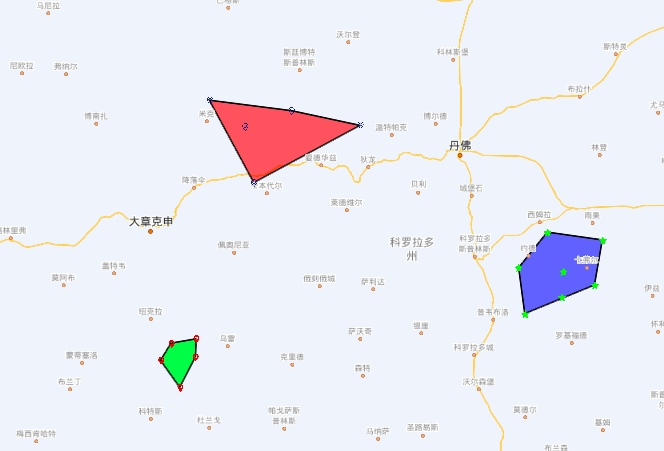

# 文档---业务代码（前端开发部分）
> 实习报告编写计划：
> - 个人独特的内容：每个人挑选一个业务函数进行编写，有条件的详细作图描述自己的业务函数。
> - 小组统一内容：系统架构设计等（在上学期报告的基础上完善）。
> - 注意：若最后个人内容较少，则可以将个人内容合并到小组统一内容中。

---

## 运行在 Demo 文件夹下的业务代码
> 推荐使用 TypeScript ，打开 ts 文件, VSCode 会提示需要安装的插件，安装即可。
1. 首先使用终端进入 Demo 文件夹
  ``` bash
    cd Demo
  ```
2. 然后安装依赖并运行
  ``` bash
    npm i
    npm run dev
  ```
3. 然后使用浏览器访问 `http://127.0.0.1:5173/` 即可查看 Demo 页面。业务代码都在 main.js 中，可以根据需要进行修改。

> 业务代码文档格式：
> - 业务函数需要的`数据`
> - 业务函数功能及`实现思路`：可以都放在代码块中，使用注释说明。
>   - 业务函数`名称`
>   - 业务函数的功能描述
>   - 业务函数依赖的外部方法（模块）
> - 业务函数`测试结果`：
>   - （若有）效果图片
>   - （若有）函数操作示意图（可以自己绘制）
>   - 测试是否通过
>   - 测试过程中遇到的问题及解决方法
> - 复用及`扩展性`：
>   - 对于可复用的代码片段，可以封装为函数，并注明使用方法及位置（一般放置在 utils 文件夹中）

## 0. 业务函数抽象整理(src/Abstract)
> 抽象出来的业务函数都放在一个文件夹中，以便于管理和复用。
### 1. `MetaDate.ts` 读取数据
该模块主要负责读取数据并处理为易于使用的数据结构，供其他模块使用。
### 2. `Utils.ts` 工具函数
该模块主要负责提供一些工具函数，供其他模块使用。（这些工具函数主要是封装重复编写的业务代码得到）
### 3. `Draw.ts` 绘图
该模块用于封装页面使用的地图服务的绘图接口，以便方便地使用地图服务的绘图功能。
### 4. 其他内容待续...

## 1.信息展示 `fun1(info,post)`
### 功能描述
### 数据
  ```json
  // info.json
  {
    "ID":"", // 唯一标识符
    "URL":"", // 图片地址
    "text":"", // 描述文字
    "location":{"lat":"","lng":""}, // 经纬度
    "locationName":"", // 地点名称
    "tags":["","",""], // 标签
  },
  // posts.json 参考 下文
  ```
### 实现思路
  ```js
  function fun1(info,post){  
      //读取数据
      //拼接景区信息部分 html字符串
      //拼接帖子部分 html字符串
  }
  // 以下是帮助函数 helpers 
  function helper1(info){ // 按照一定规则将输入的数据转换为html字符串
      // 若是数组，遍历数组，递归调用 helper1
      // 若是对象，遍历对象，递归调用 helper1
      return html;
  }
  ```
### 测试结果（未通过）
- 效果图片
- 函数操作示意图
- 测试是否通过

## 2.地图相册
```js
function fun2(photos){

  //拼接函数
  //for
  //数组 html字符串
  //for循环
}
```

```json
{
  // posts.json
  {
    "ID":"",
    "URL":"", // 图片地址
    "text":"", // 描述文字
    "time":"", // 时间戳
    "location":{"lat":"","lng":""}, // 经纬度
    "locationName":"", // 地点名称
    "tags":["","",""], // 标签
  },
  {
    // ... 
  }
}
```

## 3.聚合`fun3()` （已完成）
### 功能描述
- 对`多维点列表`，首先进行聚类，然后计算每一类的重心，最后绘制所有类的重心点和凸包。
  - `多维点列表`: 
      | ID | 经度 | 纬度 | 高度 | 时间戳 | 标签 |
      | ---- | ---- | ---- | ---- | ------ | ---- |
      | 1 |xxx.xxx|xxx.xxx|xxx.xxx|xxx.xxx|xxx.xxx|
      | 2 |xxx.xxx|xxx.xxx|xxx.xxx|xxx.xxx|xxx.xxx|
  - `聚类`: K-means 聚类，选取两个维度（经纬度）进行聚类

### 数据
  ```json
  // points.json
  {
    "ID":"", // 唯一标识符
    "location":{"lat":"","lng":""}, // 经纬度
    "tags":["","",""], // 标签
  },
  // posts.json 参考 下文
  ```
### 实现思路
```js
function fun3(){
    //kmeans()
    //凸包
    //draw
    //center
}
```
### 测试结果（已通过）
1. 效果图片:
  
2. 不足：还不支持多维聚类，只能做到二维聚类（地理空间）。
